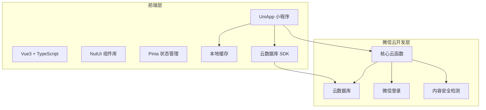
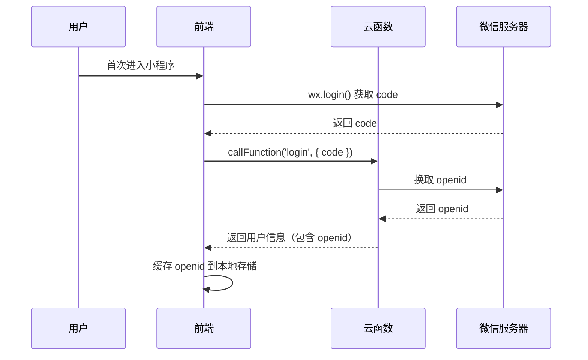
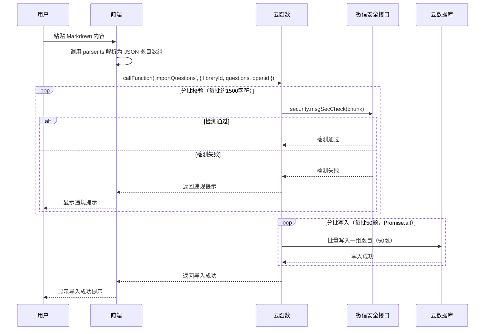
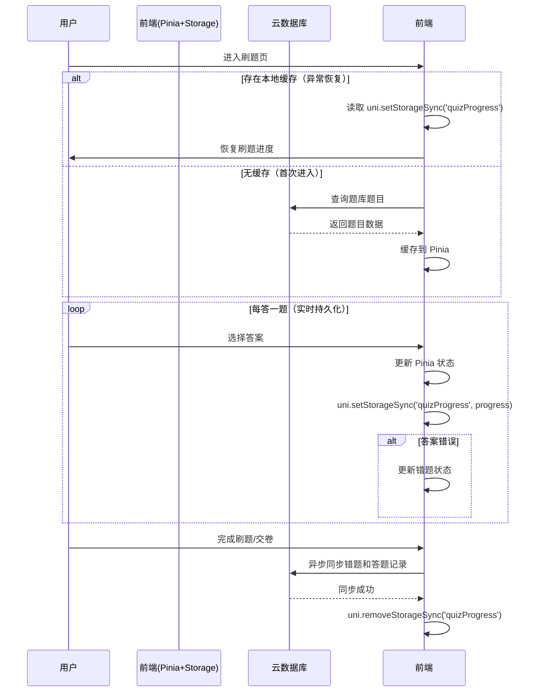

# 刷题微信小程序需求方案 v2.1

## 1. 需求分析

### 1.1 业务背景

用户需要一个能够自定义导入题库的刷题微信小程序，支持多种刷题模式，帮助用户高效学习和复习。采用微信云开发实现全栈业务，确保高效率、低成本、高安全的 MVP 实施方案。

### 1.2 核心功能需求

| 需求点     | 需求描述                           | 优先级 | 来源     |
| :------ | :----------------------------- | :-- | :----- |
| 题库导入    | 支持 Markdown 格式导入题库，支持单选、多选、判断题 | 高   | 用户要求   |
| 顺序练习    | 按题库顺序进行练习                      | 高   | 用户要求   |
| 随机练习    | 随机出题进行练习                       | 高   | 用户要求   |
| 错题重做    | 只练习做错的题目                       | 高   | 用户要求   |
| 错题本     | 记录错题并支持重做                      | 高   | 用户要求   |
| AI 文本解析 | 留有 AI 文本智能解析接口，后续可接入大模型自动切分题目  | 中   | 用户要求   |
| 用户认证    | 采用微信静默登录，使用 openid 作为用户唯一标识    | 高   | 用户要求   |
| 内容安全    | 引入微信内容安全接口进行敏感词过滤，规避长度限制       | 高   | 安全合规要求 |
| 数据容灾    | 刷题进度实时本地持久化，防止闪退丢数据            | 高   | 稳定性要求  |

### 1.3 非功能需求

* 界面简洁美观，交互流畅

* 云端存储，动态缓存，支持离线刷题

* 代码结构清晰，易于后续功能拓展

* 严格遵守微信小程序安全规范

* 低云函数成本，高性能响应

***

## 2. 技术选型

### 2.1 前端框架

* **框架**: UniApp (Vue3 + TypeScript)

* **组件库**: NutUI (移动端组件库)

* **状态管理**: Pinia

* **路由**: UniApp 原生路由

* **数据库操作**: 微信云数据库 SDK (`wx.cloud.database()`)

### 2.2 后端架构（微信云开发）

* **云服务**: 微信云开发（CloudBase）

* **数据库**: 云数据库（NoSQL，类似 MongoDB）

* **云函数**: 仅保留核心云函数（Node.js 环境）

* **云存储**: 存储题库文件和用户数据

### 2.3 技术架构图



***

## 3. 功能设计

### 3.1 功能模块划分

| 模块   | 功能说明        | 子功能                   |
| :--- | :---------- | :-------------------- |
| 题库管理 | 题库的导入、查看、删除 | Markdown 导入、题库列表、题库详情 |
| 刷题练习 | 多种刷题模式      | 顺序练习、随机练习、错题重做        |
| 错题本  | 错题记录与管理     | 错题列表、错题重做、错题删除        |
| 统计分析 | 学习数据统计      | 正确率统计、答题记录            |
| 设置   | 系统设置        | 数据管理、关于我们             |
| 用户认证 | 静默登录        | openid 获取、会话管理        |

### 3.2 页面结构

```
├── 首页 (pages/index)
│   ├── 题库列表入口
│   ├── 刷题模式选择
│   ├── 学习统计概览
├── 题库管理页 (pages/library)
│   ├── 题库列表
│   ├── 导入题库按钮
│   ├── 删除题库操作
├── 刷题页 (pages/quiz)
│   ├── 题目展示
│   ├── 选项选择
│   ├── 答案解析
├── 错题本页 (pages/wrong)
│   ├── 错题列表
│   ├── 重做错题按钮
├── 设置页 (pages/settings)
│   ├── 数据清除
│   ├── 关于我们
```

### 3.3 核心业务流程

#### 3.3.1 用户登录流程



#### 3.3.2 题库导入流程（前端解析+分批安全检测+分批写入）



#### 3.3.3 刷题流程（实时本地持久化+容灾恢复）



***

## 4. 数据库设计

### 4.1 云数据库集合设计

#### 4.1.1 题库集合 (libraries)

| 字段名            | 类型     | 说明       | 约束   |
| :------------- | :----- | :------- | :--- |
| \_id           | String | 主键（自动生成） | 必填   |
| name           | String | 题库名称     | 必填   |
| description    | String | 题库描述     | 可选   |
| totalQuestions | Number | 题目总数     | 默认 0 |
| createdAt      | Date   | 创建时间     | 自动生成 |
| updatedAt      | Date   | 更新时间     | 自动更新 |

#### 4.1.2 题目集合 (questions)

| 字段名        | 类型     | 说明                            | 约束   |
| :--------- | :----- | :---------------------------- | :--- |
| \_id       | String | 主键（自动生成）                      | 必填   |
| libraryId  | String | 所属题库 ID                       | 必填   |
| type       | String | 题目类型（single/multiple/judge）   | 必填   |
| content    | String | 题目内容                          | 必填   |
| options    | Array  | 选项列表（如 \["A. 选项A", "B. 选项B"]） | 必填   |
| answer     | Array  | 正确答案（如 \["A", "B"]）           | 必填   |
| analysis   | String | 答案解析                          | 可选   |
| difficulty | Number | 难度等级（1-5）                     | 默认 1 |
| createdAt  | Date   | 创建时间                          | 自动生成 |

#### 4.1.3 错题集合 (wrongQuestions)

| 字段名           | 类型     | 说明       | 约束   |
| :------------ | :----- | :------- | :--- |
| \_id          | String | 主键（自动生成） | 必填   |
| questionId    | String | 题目 ID    | 必填   |
| openid        | String | 用户微信标识   | 必填   |
| userAnswer    | Array  | 用户答案     | 必填   |
| wrongCount    | Number | 错误次数     | 默认 1 |
| lastWrongTime | Date   | 最后错误时间   | 必填   |

#### 4.1.4 答题记录集合 (userRecords)

| 字段名        | 类型      | 说明       | 约束   |
| :--------- | :------ | :------- | :--- |
| \_id       | String  | 主键（自动生成） | 必填   |
| openid     | String  | 用户微信标识   | 必填   |
| questionId | String  | 题目 ID    | 必填   |
| libraryId  | String  | 题库 ID    | 必填   |
| isCorrect  | Boolean | 是否正确     | 必填   |
| answerTime | Date    | 答题时间     | 必填   |
| duration   | Number  | 答题耗时（秒）  | 默认 0 |

#### 4.1.5 用户统计集合 (userStats)

| 字段名            | 类型     | 说明         | 约束   |
| :------------- | :----- | :--------- | :--- |
| \_id           | String | 主键（openid） | 必填   |
| totalQuestions | Number | 总答题数       | 默认 0 |
| correctCount   | Number | 正确数        | 默认 0 |
| todayQuestions | Number | 今日答题数      | 默认 0 |
| todayCorrect   | Number | 今日正确数      | 默认 0 |
| updatedAt      | Date   | 更新时间       | 自动更新 |

***

## 5. API 接口设计（云函数）

### 5.1 云函数列表

| 云函数名            | 功能描述            | 触发方式 |
| :-------------- | :-------------- | :--- |
| login           | 用户登录，获取 openid  | 前端调用 |
| importQuestions | 批量导入题目（含分批安全检测） | 前端调用 |
| aiParse         | AI 文本解析（预留）     | 前端调用 |

> **说明**：题库 CRUD、题目 CRUD、错题管理、答题记录、用户统计等操作，均由前端直接调用云数据库 SDK 完成，无需云函数中转。

### 5.2 云函数输入输出示例

#### 5.2.1 login（用户登录）

**输入**:

```json
{
  "code": "wx.login 返回的 code"
}
```

**输出**:

```json
{
  "success": true,
  "data": {
    "openid": "用户唯一标识",
    "sessionKey": "会话密钥（前端不存储）"
  }
}
```

#### 5.2.2 importQuestions（导入题目）

**输入**:

```json
{
  "libraryId": "题库ID",
  "questions": [
    {
      "type": "single",
      "content": "题目内容？",
      "options": ["A. 选项A", "B. 选项B", "C. 选项C", "D. 选项D"],
      "answer": ["A"],
      "analysis": "解析内容",
      "difficulty": 1
    }
  ],
  "openid": "用户openid"
}
```

**输出**:

```json
{
  "success": true,
  "message": "导入成功",
  "data": {
    "importedCount": 1,
    "failedCount": 0
  }
}
```

#### 5.2.3 aiParse（AI 文本解析，预留）

**输入**:

```json
{
  "text": "1. 题目一内容 A.选项1 B.选项2 C.选项3 D.选项4 答案：A",
  "openid": "用户openid"
}
```

**输出**:

```json
{
  "success": true,
  "data": [
    {
      "type": "single",
      "content": "题目一内容",
      "options": ["A. 选项1", "B. 选项2", "C. 选项3", "D. 选项4"],
      "answer": ["A"],
      "analysis": ""
    }
  ]
}
```

### 5.3 Markdown 语法规范

| 题目类型 | 语法约定                  | 示例     |
| :--- | :-------------------- | :----- |
| 单选题  | `答案：A`（单个字母）          | 答案：B   |
| 多选题  | `答案：A,B,C` 或 `答案：ABC` | 答案：A,C |
| 判断题  | `答案：正确` 或 `答案：错误`     | 答案：错误  |

**完整 Markdown 示例**:

```markdown
# 题库名称
## 题库描述（可选）

## 单选题
1. 题目内容？
A. 选项A
B. 选项B
C. 选项C
D. 选项D
答案：A
解析：这是解析内容

## 多选题
2. 多选题内容？
A. 选项A
B. 选项B
C. 选项C
答案：A,C
解析：多选解析

## 判断题
3. 判断题内容？
答案：正确
解析：判断解析
```

***

## 6. 前端页面设计

### 6.1 首页设计

**页面路径**: `pages/index`

| 区域        | 组件     | 功能说明               |
| :-------- | :----- | :----------------- |
| 顶部 Banner | View   | 展示应用名称和图标          |
| 学习统计卡片    | View   | 今日完成数、正确率、总答题数     |
| 刷题模式选择    | View   | 顺序练习、随机练习、错题重做三个入口 |
| 题库列表入口    | Button | 跳转题库管理页            |
| 快速练习      | Button | 选择最近题库快速开始         |

### 6.2 题库管理页设计

**页面路径**: `pages/library`

| 区域   | 组件          | 功能说明                      |
| :--- | :---------- | :------------------------ |
| 顶部导航 | NavBar      | 返回、标题、添加按钮                |
| 题库列表 | List        | 展示所有题库，支持下拉刷新             |
| 导入弹窗 | Modal       | 支持 Markdown 文本输入，前端实时解析预览 |
| 操作菜单 | ActionSheet | 删除、编辑、开始练习                |

### 6.3 刷题页设计

**页面路径**: `pages/quiz`

| 区域     | 组件       | 功能说明         |
| :----- | :------- | :----------- |
| 进度条    | Progress | 显示当前答题进度     |
| 题目类型标签 | View     | 显示单选/多选/判断   |
| 题目内容   | View     | 展示题目内容       |
| 选项列表   | List     | 展示选项，单选/多选切换 |
| 答案解析   | View     | 答题后显示正确答案和解析 |
| 操作按钮   | Button   | 上一题、下一题、提交   |
| 本地缓存状态 | View     | 显示"已自动保存"提示  |

### 6.4 错题本页设计

**页面路径**: `pages/wrong`

| 区域   | 组件     | 功能说明          |
| :--- | :----- | :------------ |
| 顶部导航 | NavBar | 返回、标题         |
| 错题统计 | View   | 显示错题总数        |
| 错题列表 | List   | 展示错题列表，显示错误次数 |
| 操作按钮 | Button | 清空错题、开始重做     |

### 6.5 设置页设计

**页面路径**: `pages/settings`

| 区域   | 组件   | 功能说明             |
| :--- | :--- | :--------------- |
| 用户信息 | View | 显示用户头像、昵称（微信授权后） |
| 数据管理 | View | 清除本地缓存、数据同步      |
| 关于我们 | View | 版本信息、使用说明        |

***

## 7. 项目结构

### 7.1 前端项目结构

```
src/
├── components/          # 公共组件
│   ├── QuizOption.vue   # 题目选项组件
│   ├── QuestionCard.vue # 题目卡片组件
│   ├── StatsCard.vue    # 统计卡片组件
│   └── NavBar.vue       # 导航栏组件
├── pages/               # 页面
│   ├── index/           # 首页
│   │   ├── index.vue
│   │   └── index.ts
│   ├── library/         # 题库管理页
│   │   ├── index.vue
│   │   └── index.ts
│   ├── quiz/            # 刷题页
│   │   ├── index.vue
│   │   └── index.ts
│   ├── wrong/           # 错题本页
│   │   ├── index.vue
│   │   └── index.ts
│   └── settings/        # 设置页
│       ├── index.vue
│       └── index.ts
├── stores/              # Pinia 状态管理
│   ├── user.ts          # 用户状态（openid）
│   ├── library.ts       # 题库状态
│   ├── quiz.ts          # 刷题状态（含进度恢复逻辑）
│   ├── wrong.ts         # 错题状态
│   └── stats.ts         # 统计状态
├── utils/               # 工具函数
│   ├── parser.ts        # Markdown 解析器（前端解析核心）
│   ├── aiParser.ts      # AI 解析接口（预留）
│   ├── cloud.ts         # 云函数调用封装
│   └── storage.ts       # 本地存储工具（实时持久化）
├── types/               # TypeScript 类型定义
│   └── index.ts         # 类型定义
├── App.vue              # 根组件
├── main.ts              # 入口文件
├── pages.json           # 页面配置
└── manifest.json        # 应用配置
```

### 7.2 云函数项目结构（精简版）

```
cloudfunctions/
├── login/               # 用户登录（唯一身份认证入口）
│   ├── index.js
│   └── package.json
├── importQuestions/     # 导入题目（含分批安全检测）
│   ├── index.js
│   └── package.json
└── aiParse/             # AI 解析（预留大模型接口）
    ├── index.js
    └── package.json
```

***

## 8. 关键类与方法设计

### 8.1 前端关键类/方法

#### 8.1.1 云函数调用封装 (utils/cloud.ts)

| 方法名          | 功能说明  | 参数                      | 返回值                         |
| :----------- | :---- | :---------------------- | :-------------------------- |
| callFunction | 调用云函数 | name: string, data: any | Promise\<any>               |
| login        | 用户登录  | 无                       | Promise<{ openid: string }> |

#### 8.1.2 Markdown 解析器 (utils/parser.ts)

| 方法名                | 功能说明                   | 参数              | 返回值                               |
| :----------------- | :--------------------- | :-------------- | :-------------------------------- |
| parseMarkdown      | 解析 Markdown 格式题库为 JSON | content: string | Question\[]                       |
| parseQuestionBlock | 解析单个题目块                | block: string   | Question                          |
| detectQuestionType | 检测题目类型                 | content: string | 'single' \| 'multiple' \| 'judge' |

#### 8.1.3 本地存储工具类 (utils/storage.ts)

| 方法名               | 功能说明   | 参数                      | 返回值                  |
| :---------------- | :----- | :---------------------- | :------------------- |
| setQuizProgress   | 保存刷题进度 | progress: QuizProgress  | void                 |
| getQuizProgress   | 获取刷题进度 | 无                       | QuizProgress \| null |
| clearQuizProgress | 清除刷题进度 | 无                       | void                 |
| setItem           | 设置存储项  | key: string, value: any | void                 |
| getItem           | 获取存储项  | key: string             | any                  |
| removeItem        | 删除存储项  | key: string             | void                 |
| clear             | 清空存储   | 无                       | void                 |

#### 8.1.4 AI 解析接口 (utils/aiParser.ts)

| 方法名       | 功能说明    | 参数           | 返回值                   |
| :-------- | :------ | :----------- | :-------------------- |
| parseText | AI 文本解析 | text: string | Promise\<Question\[]> |

### 8.2 云函数关键方法

#### 8.2.1 login 云函数

| 方法名  | 功能说明      | 参数                      | 返回值                |
| :--- | :-------- | :---------------------- | :----------------- |
| main | 获取 openid | event: { code: string } | { openid: string } |

#### 8.2.2 importQuestions 云函数

| 方法名                     | 功能说明             | 参数                                      | 返回值               |
| :---------------------- | :--------------- | :-------------------------------------- | :---------------- |
| main                    | 导入题目（含分批安全检测+分批写入） | event: { libraryId, questions, openid } | { success, data } |
| checkContentSafetyBatch | 分批调用微信安全接口       | contents: string\[], batchSize: number  | Promise\<boolean> |
| chunkContents           | 将内容分块（每块约1500字符） | contents: string\[]                     | string\[]         |
| batchInsertQuestions    | 分批写入数据库（每批50题）   | questions: any\[], chunkSize: number    | Promise\<number>  |

***

## 9. 部署与集成方案

### 9.1 微信云开发配置

1. **开通云开发**:

   * 在微信开发者工具中创建小程序项目

   * 开通云开发服务，创建云开发环境

   * 记录云开发环境 ID

2. **云数据库配置**:

   * 创建集合：`libraries`, `questions`, `wrongQuestions`, `userRecords`, `userStats`

   * 配置集合权限（安全规则）：

     ```javascript
     // 仅创建者可读写
     {
       "read": "true", // 所有人可读（或者根据业务调整为：auth.openid != null）
       "write": "auth.openid == resource.data.openid" // 只有创建者可以修改/删除
     }
     ```

   * 题库集合 `libraries` 设为公开可读（方便展示题库列表）

3. **云函数部署**:

   * 创建精简的云函数目录结构（仅3个云函数）

   * 在 `importQuestions` 云函数中配置安全检测逻辑

   * 在开发者工具中上传并部署云函数

### 9.2 前端配置

1. **初始化 UniApp 项目**:

   ```bash
   npx degit dcloudio/uni-preset-vue#vite-ts .
   npm install
   ```

2. **安装依赖**:

   ```bash
   npm install @dcloudio/uni-ui @pinia/uni-app nutui-uniapp
   ```

3. **配置云开发**:

   * 在 `manifest.json` 中配置云开发环境 ID

   * 在 App.vue 中初始化云开发：

     ```javascript
     onLaunch(() => {
       wx.cloud.init({
         env: 'your-env-id'
       })
     })
     ```

### 9.3 安全配置

1. **内容安全**:

   * 在 `importQuestions` 云函数中分批调用 `security.msgSecCheck`

   * 每批内容控制在约1500字符以内

2. **数据权限**:

   * 云数据库集合设置为"仅创建者可读写"

   * 使用 openid 作为用户唯一标识

3. **本地缓存安全**:

   * 本地存储仅保存刷题进度，不存储敏感信息

   * 同步到云端后立即清除本地缓存

***

## 10. 代码安全性

### 10.1 前端安全

| 风险点    | 解决方案                        |
| :----- | :-------------------------- |
| XSS 攻击 | 使用 Vue 模板语法自动转义，避免使用 v-html |
| 数据篡改   | 敏感操作通过云函数执行，前端仅做展示          |
| 本地存储安全 | 仅存储刷题进度和 openid，不存储敏感信息     |
| 缓存泄露   | 完成刷题后立即清除本地缓存               |

### 10.2 云函数安全

| 风险点   | 解决方案                                |
| :---- | :---------------------------------- |
| 未授权访问 | 验证 openid，确保用户只能操作自己的数据             |
| 输入验证  | 对所有输入参数进行类型和格式验证                    |
| 内容安全  | 分批调用 `security.msgSecCheck` 进行敏感词过滤 |
| 长度限制  | 规避单次请求长度限制，采用分块校验                   |

### 10.3 数据安全

| 风险点  | 解决方案                 |
| :--- | :------------------- |
| 数据泄露 | 云数据库权限设置为仅创建者可读      |
| 数据备份 | 微信云开发自动备份            |
| 敏感信息 | 不存储用户敏感信息，仅使用 openid |
| 容灾恢复 | 本地实时持久化，支持异常恢复       |

***

## 11. 后续拓展接口

### 11.1 AI 功能拓展

| 接口         | 功能        | 状态 |
| :--------- | :-------- | :- |
| aiParse    | AI 文本智能解析 | 预留 |
| aiGenerate | AI 题目生成   | 预留 |

### 11.2 多格式导入拓展

| 功能       | 状态 |
| :------- | :- |
| Excel 导入 | 预留 |
| Word 导入  | 预留 |

### 11.3 社交功能拓展

| 功能   | 状态 |
| :--- | :- |
| 学习小组 | 预留 |
| 排行榜  | 预留 |
| 分享功能 | 预留 |

### 11.4 用户体验拓展

| 功能   | 状态 |
| :--- | :- |
| 学习计划 | 预留 |
| 数据导出 | 预留 |
| 题目收藏 | 预留 |

***

## 12. 开发计划

### 12.1 第一阶段：基础功能开发（1-2 周）

| 任务          | 描述                   | 预估时间 |
| :---------- | :------------------- | :--- |
| 项目初始化       | 创建 UniApp 项目，配置云开发环境 | 1 天  |
| 用户登录        | 实现微信静默登录，获取 openid   | 1 天  |
| 题库管理        | 前端直连云数据库，实现 CRUD     | 2 天  |
| Markdown 解析 | 前端解析器开发，支持单选/多选/判断   | 2 天  |
| 题目导入        | 云函数安全检测与批量写入         | 2 天  |
| 刷题功能        | 顺序练习、随机练习，实时本地持久化    | 3 天  |
| 错题本         | 前端直连云数据库，实现错题管理      | 2 天  |

### 12.2 第二阶段：优化与完善（1 周）

| 任务    | 描述          | 预估时间 |
| :---- | :---------- | :--- |
| 统计分析  | 添加学习数据统计功能  | 2 天  |
| 容灾恢复  | 刷题进度异常恢复逻辑  | 1 天  |
| UI 优化 | 优化界面设计和交互体验 | 2 天  |
| 测试修复  | 修复 Bug，完善功能 | 2 天  |
| 文档编写  | 编写使用说明和开发文档 | 1 天  |

### 12.3 第三阶段：预留接口开发（按需）

| 任务      | 描述               | 状态 |
| :------ | :--------------- | :- |
| AI 文本解析 | 接入大模型实现智能解析      | 预留 |
| 多格式导入   | 支持 Excel/Word 导入 | 预留 |

***

**文档版本**: v2.1\
**创建日期**: 2024年\
**作者**: Trae AI
