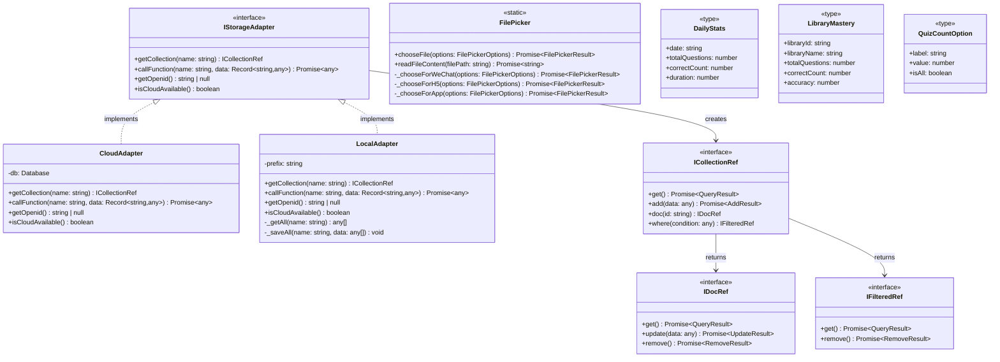
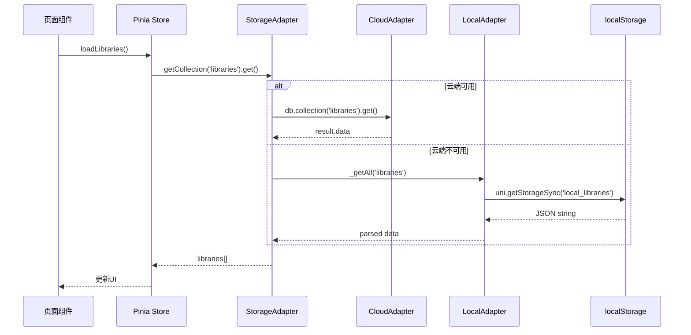
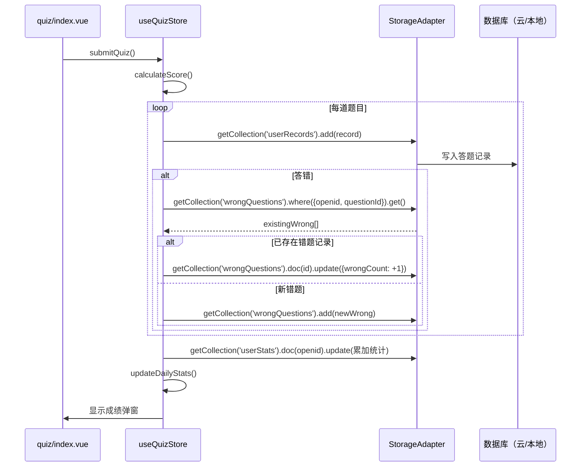
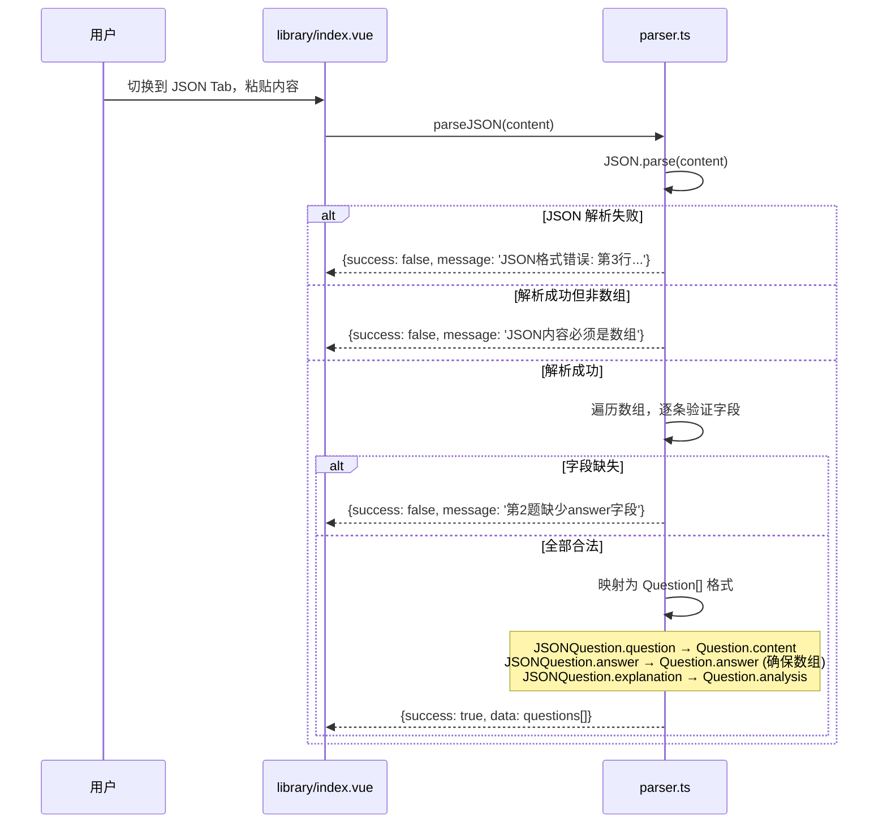
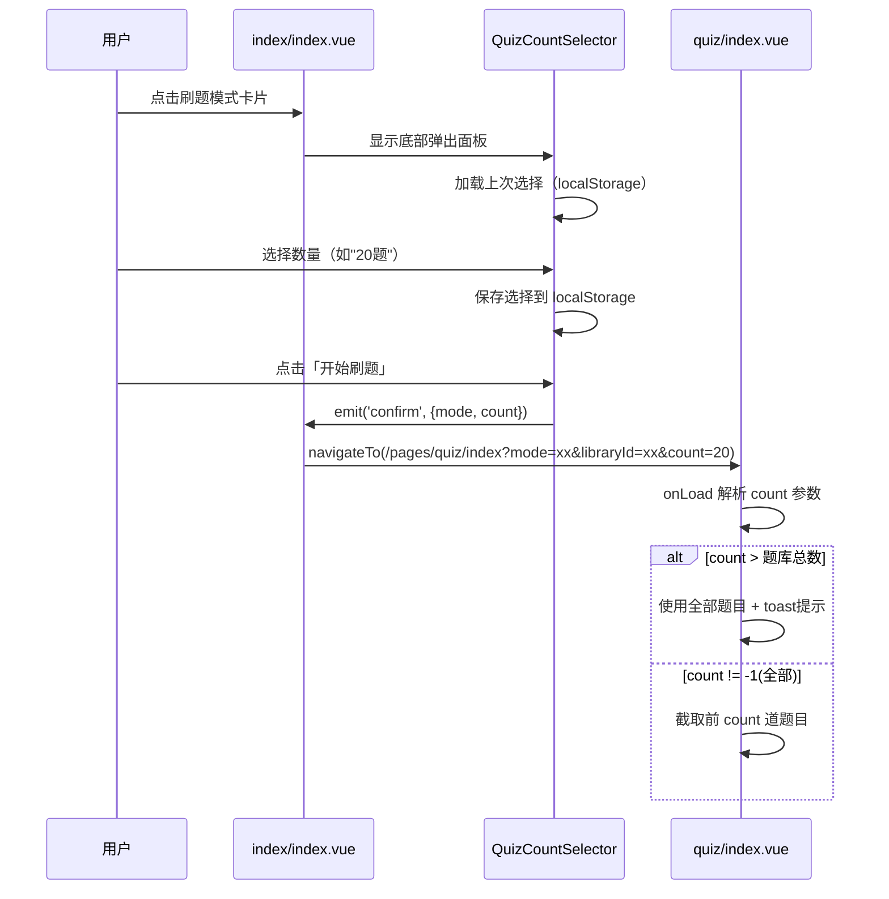
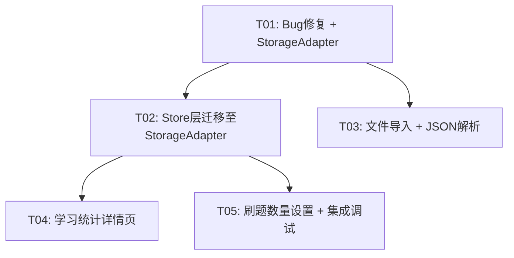

# 智慧刷题（ZhiHui Quiz）增量架构设计 v1.1

- **架构师**：高见远（Gao）
- **日期**：2025-07-14
- **基线版本**：v1.0 → v1.1
- **关联文档**：`docs/prd-increment-v1.1.md`

---

## Part A：系统设计

### 1. 实现方案 + 框架选型

#### 1.1 核心技术挑战

| 挑战 | 说明 | 解决策略 |
|------|------|----------|
| 跨环境存储适配 | 微信小程序用腾讯云SDK，H5/App 无云开发能力 | 策略模式：`StorageAdapter` 接口 + 工厂函数自动检测环境 |
| 批量写入原子性 | BUG-03 根因：`db.command.batch()` 不存在 | 逐条 `Promise.all` 分批写入 + 手动事务补偿 |
| 文件选择跨平台 | 小程序/H5/App 文件API不同 | 条件编译 + 统一适配函数 |
| 统计趋势图渲染 | UniApp 中 Canvas/ECharts 生态复杂 | 选用 `@qiun/ucharts` 轻量折线图方案 |

#### 1.2 框架与库选型

| 依赖 | 版本 | 用途 | 选型理由 |
|------|------|------|----------|
| `@qiun/ucharts` | ^2.5 | 统计页折线图 | UniApp 生态最成熟的跨端图表库，支持 Canvas 2D |
| `@dcloudio/uni-ui` | ^1.5 | `uni-popup` 底部弹出面板 | 官方组件，多端一致，用于刷题数量选择 |

> 无需引入其他重型库，StorageAdapter 使用纯 TypeScript 接口实现。

#### 1.3 架构模式

在现有 **Pinia + Vue3 Composition API** 架构上扩展：

- **策略模式（Strategy）**：`StorageAdapter` — 运行时根据环境切换存储实现
- **工厂模式（Factory）**：`createStorageAdapter()` — 自动检测环境并返回适配器实例
- **适配器模式（Adapter）**：`FilePicker` — 屏蔽平台差异，统一文件选择接口

整体架构分层：

```
┌─────────────────────────────────────┐
│          Pages / Components          │  视图层
├─────────────────────────────────────┤
│          Pinia Stores               │  状态层
├─────────────────────────────────────┤
│      StorageAdapter (Interface)     │  适配层 ← 新增核心
├──────────┬──────────────────────────┤
│ CloudAdapter │ LocalAdapter         │  实现层
└──────────┴──────────────────────────┘
```

---

### 2. 文件列表

以下列出 v1.1 涉及的所有**新增**和**修改**文件（未列出者表示不变）：

#### 新增文件

| 相对路径 | 说明 |
|----------|------|
| `src/adapters/storageAdapter.ts` | StorageAdapter 接口定义 + CloudAdapter + LocalAdapter + 工厂函数 |
| `src/adapters/filePicker.ts` | 跨平台文件选择适配器 |
| `src/pages/statistics/index.vue` | 学习统计详情页 |
| `src/components/QuizCountSelector.vue` | 刷题数量选择底部弹出组件 |
| `src/components/ChartLine.vue` | uCharts 折线图封装组件 |

#### 修改文件

| 相对路径 | 修改内容 |
|----------|----------|
| `src/types/index.ts` | 新增 `DailyStats`、`LibraryMastery`、`QuizCountOption` 类型；`Question.options` 改为可选 |
| `src/utils/parser.ts` | BUG-02 修复 + 新增 `parseJSON()` 方法 |
| `src/utils/storage.ts` | 新增 `DailyStats` 相关 localStorage 读写方法 |
| `src/stores/library.ts` | 改用 `StorageAdapter` 替代直接 `uni.cloud` 调用 |
| `src/stores/quiz.ts` | BUG-03 修复（重写 `saveResults`）+ 新增 `quizCount` 状态 |
| `src/stores/wrong.ts` | 改用 `StorageAdapter` |
| `src/stores/stats.ts` | 改用 `StorageAdapter` + 新增 `loadDailyStats` / `getLibraryMastery` |
| `src/stores/user.ts` | 适配离线模式（无 openid 时使用本地 userId） |
| `src/pages/library/index.vue` | BUG-04 修复 + 导入弹窗改版（三Tab：Markdown/JSON/文件） |
| `src/pages/wrong/index.vue` | BUG-05 修复 + 适配离线模式 |
| `src/pages/quiz/index.vue` | 适配 `quizCount` + 处理 `questionId` 跳转参数 |
| `src/pages/index/index.vue` | 今日统计区域可点击跳转 + 刷题入口集成数量选择 |
| `src/pages.json` | 新增 `/pages/statistics/index` 路由 |
| `cloudfunctions/importQuestions/index.js` | BUG-01 修复 L46 |

---

### 3. 数据结构和接口

#### 3.1 类图



#### 3.2 新增类型定义

```typescript
// === src/types/index.ts 新增 ===

/** 每日统计 */
export interface DailyStats {
  date: string           // 'YYYY-MM-DD'
  totalQuestions: number
  correctCount: number
  duration: number       // 总耗时（秒）
}

/** 题库掌握度 */
export interface LibraryMastery {
  libraryId: string
  libraryName: string
  totalQuestions: number
  correctCount: number
  accuracy: number       // 0-100
}

/** 刷题数量选项 */
export interface QuizCountOption {
  label: string          // '10题' | '20题' | '50题' | '全部'
  value: number          // 10 | 20 | 50 | -1 (全部=-1)
  isAll: boolean
}

/** 文件选择器选项 */
export interface FilePickerOptions {
  extensions: string[]   // ['.txt', '.md']
  maxFileSize: number    // 字节，默认 2MB
}

/** 文件选择结果 */
export interface FilePickerResult {
  path: string
  name: string
  size: number
  content: string        // 文件文本内容
}

/** JSON 导入题目格式 */
export interface JSONQuestion {
  type: 'single' | 'multiple' | 'judge'
  question: string
  options?: string[]
  answer: string | string[]
  explanation?: string
}
```

#### 3.3 Question 类型修改

```typescript
// 修改：options 改为可选（判断题无选项）
export interface Question {
  _id?: string
  libraryId: string
  type: 'single' | 'multiple' | 'judge'
  content: string
  options?: string[]     // ← 改为可选，修复 BUG-02
  answer: string[]
  analysis?: string
  difficulty: number
  createdAt?: Date
}
```

#### 3.4 StorageAdapter 核心接口

```typescript
// src/adapters/storageAdapter.ts

export interface IStorageAdapter {
  /** 获取集合引用 */
  getCollection(name: string): ICollectionRef
  /** 调用云函数（本地模式返回模拟结果） */
  callFunction(name: string, data: Record<string, any>): Promise<any>
  /** 获取当前用户标识 */
  getOpenid(): string | null
  /** 云端是否可用 */
  isCloudAvailable(): boolean
}

export function createStorageAdapter(): IStorageAdapter {
  // 检测 uni.cloud 是否可用
  try {
    if (typeof uni !== 'undefined' && uni.cloud) {
      return new CloudAdapter()
    }
  } catch (e) {
    console.warn('云开发不可用，降级为本地存储', e)
  }
  return new LocalAdapter()
}

// 全局单例
export const storageAdapter = createStorageAdapter()
```

#### 3.5 LocalAdapter 存储结构

本地模式下，所有数据存储在 `uni.setStorageSync` 中，key 命名规范：

| key | 类型 | 说明 |
|-----|------|------|
| `local_libraries` | `Library[]` | 题库列表 |
| `local_questions_{libraryId}` | `Question[]` | 按题库分key的题目 |
| `local_wrongQuestions` | `WrongQuestion[]` | 错题集 |
| `local_userRecords` | `UserRecord[]` | 答题记录 |
| `local_userStats` | `UserStats` | 用户统计 |
| `local_dailyStats` | `DailyStats[]` | 每日统计 |
| `local_userId` | `string` | 本地生成的用户标识 |
| `local_quizCount` | `number` | 上次选择的刷题数量 |

---

### 4. 程序调用流程

#### 4.1 离线模式数据读写流程



#### 4.2 答题结果保存流程（BUG-03 修复后）



#### 4.3 文件导入流程

```mermaid
sequenceDiagram
    participant User as 用户
    participant Library as library/index.vue
    participant Picker as FilePicker
    participant Parser as parser.ts
    participant Store as useLibraryStore

    User->>Library: 点击「选择文件」
    Library->>Picker: chooseFile({extensions: ['.txt', '.md'], maxFileSize: 2*1024*1024})
    
    alt 微信小程序
        Picker->>Picker: uni.chooseMessageFile()
    else H5
        Picker->>Picker: document.createElement('input', {type:'file'})
    else App
        Picker->>Picker: uni.chooseFile()
    end
    
    Picker->>Picker: readFileContent(filePath)
    Picker-->>Library: {name, size, content}
    Library->>Library: 自动填充到文本框预览
    
    User->>Library: 点击「确认导入」
    Library->>Parser: parseMarkdown(content) 或 parseJSON(content)
    Parser-->>Library: questions[]
    Library->>Store: importQuestions(libraryId, questions, openid)
    Store-->>Library: result
    Library->>Library: closeModal() ← BUG-04 修复：无论成功失败都关闭
```



#### 4.4 JSON 解析流程



#### 4.5 刷题数量选择流程



---

### 5. 待明确事项

| # | 事项 | 假设 | 风险 |
|---|------|------|------|
| 1 | `DailyStats` 数据来源 | 累计统计时按日聚合 `UserRecord`，同时维护一个每日快照减少计算量 | 若 `UserRecord` 数据量极大，聚合计算可能慢 |
| 2 | 折线图库兼容性 | `@qiun/ucharts` 支持 UniApp 全端 | 需验证微信小程序 Canvas 2D 兼容性 |
| 3 | H5 文件选择安全性 | H5 使用 `<input type="file">` | 部分浏览器可能限制 `.md` MIME 类型 |
| 4 | 离线模式用户标识 | 使用 `localStorage` 生成 UUID 作为 `local_userId` | 多设备数据无法关联（已知限制，本期不做同步） |
| 5 | `uni-popup` 依赖 | 使用 `@dcloudio/uni-ui` 的 `uni-popup` | 项目已有 `nutui-uniapp`，是否冲突需验证 |

---

## Part B：任务分解

### 6. 必需包

```
- @qiun/ucharts@^2.5.0: UniApp 跨端图表组件，用于统计页折线图
- @dcloudio/uni-ui@^1.5.0: 官方UI组件库，使用 uni-popup 组件（若项目未安装）
```

> 注意：`nutui-uniapp` 已在 `package.json` 中，可用其 Popup 替代 `uni-popup`，需工程师确认。

---

### 7. 任务列表

#### T01: Bug修复 + StorageAdapter 基础设施

- **任务ID**：T01
- **优先级**：P0
- **复杂度**：L
- **依赖**：无
- **描述**：修复全部 5 个 P0 Bug + 实现 StorageAdapter 接口及两个实现类 + 工厂函数。这是后续所有功能的地基。
- **涉及文件**：
  - `cloudfunctions/importQuestions/index.js` — BUG-01：L46 `batch.length` → `importedCount`（使用实际插入数）
  - `src/utils/parser.ts` — BUG-02：L83 `question.options.length` → `(question.options && question.options.length > 0) ? ... : options`
  - `src/stores/quiz.ts` — BUG-03：重写 `saveResults()`，去掉 `db.command.batch()`，改为逐条 `Promise.all` 分批写入
  - `src/pages/library/index.vue` — BUG-04：在 `saveLibrary()` 所有失败分支添加 `closeModal()`
  - `src/pages/wrong/index.vue` — BUG-05：`startReview` 传递 `questionId` 参数，`quiz/index.vue` 的 `onMounted` 解析并跳转到对应题目
  - `src/pages/quiz/index.vue` — BUG-05：处理 `questionId` 查询参数
  - `src/types/index.ts` — `Question.options` 改为 `options?: string[]`
  - `src/adapters/storageAdapter.ts` — **新增**：`IStorageAdapter` 接口 + `ICollectionRef` / `IDocRef` / `IFilteredRef` 接口 + `CloudAdapter` + `LocalAdapter` + `createStorageAdapter()` 工厂函数
  - `src/components/QuestionCard.vue` — 适配 `options` 可选
- **验收标准**：
  - 5 个 Bug 均修复，可手动验证
  - `storageAdapter` 单例可在控制台打印，`isCloudAvailable()` 在微信环境返回 true，H5 返回 false
  - `LocalAdapter` 的 CRUD 操作可在 H5 端正常读写 localStorage

---

#### T02: Store 层迁移至 StorageAdapter + 离线模式完善

- **任务ID**：T02
- **优先级**：P0
- **复杂度**：L
- **依赖**：T01
- **描述**：将所有 Pinia Store 中的直接 `uni.cloud` 调用替换为 `storageAdapter`，使离线模式真正可用。同时完善 `user.ts` 的离线用户标识。
- **涉及文件**：
  - `src/stores/library.ts` — 所有 `uni.cloud.database()` 替换为 `storageAdapter.getCollection()`
  - `src/stores/quiz.ts` — `saveResults` / `updateStats` 替换为 `storageAdapter` 调用
  - `src/stores/wrong.ts` — `loadWrongQuestions` / `deleteWrongQuestion` 等替换
  - `src/stores/stats.ts` — `loadStats` 替换 + 新增 `loadDailyStats(rangeDays: number): DailyStats[]` 和 `getLibraryMastery(): LibraryMastery[]`
  - `src/stores/user.ts` — 离线时生成 `local_userId`（UUID），`getUserId()` 返回 `openid || localUserId`
  - `src/utils/storage.ts` — 新增 `getDailyStats()` / `setDailyStats()` / `getLocalUserId()` 等辅助函数
- **验收标准**：
  - H5 端完整流程：创建题库 → 导入题目 → 刷题 → 查看错题本，全部走 localStorage
  - 微信小程序端：功能不受影响，仍走云开发
  - `console.log(storageAdapter.isCloudAvailable())` 在两个环境输出正确结果

---

#### T03: 文件导入 + JSON 解析 + 导入弹窗改版

- **任务ID**：T03
- **优先级**：P1
- **复杂度**：M
- **依赖**：T01
- **描述**：实现跨平台文件选择器、JSON 解析方法，以及导入弹窗的三 Tab 切换 UI。
- **涉及文件**：
  - `src/adapters/filePicker.ts` — **新增**：`FilePicker.chooseFile()` + `readFileContent()`，条件编译支持微信/H5/App
  - `src/utils/parser.ts` — 新增 `parseJSON(content: string): ParseResult` 方法，含错误行定位
  - `src/types/index.ts` — 新增 `JSONQuestion` / `FilePickerOptions` / `FilePickerResult` / `ParseResult` 类型
  - `src/pages/library/index.vue` — 导入弹窗改版：三 Tab（Markdown/JSON/文件）、文件选择按钮、预览逻辑
- **验收标准**：
  - Markdown Tab：行为与 v1.0 一致
  - JSON Tab：粘贴合法 JSON 可正确解析，非法 JSON 给出具体错误提示
  - 文件 Tab：微信端可选择聊天文件，H5 端可选择本地 .txt/.md 文件，选择后自动填充预览
  - 所有分支（成功/失败）均正确关闭弹窗

---

#### T04: 学习统计详情页

- **任务ID**：T04
- **优先级**：P1
- **复杂度**：M
- **依赖**：T02
- **描述**：新增统计详情页，包含累计数据、折线图、题库掌握度列表。首页今日统计区域可点击跳转。
- **涉及文件**：
  - `src/pages/statistics/index.vue` — **新增**：统计详情页面（累计统计卡片 + 折线图 + 题库掌握度列表）
  - `src/components/ChartLine.vue` — **新增**：基于 `@qiun/ucharts` 的折线图封装组件
  - `src/types/index.ts` — 新增 `DailyStats` / `LibraryMastery` 类型
  - `src/pages/index/index.vue` — 今日统计卡片区域添加点击事件，`navigateTo('/pages/statistics/index')`
  - `src/pages.json` — 新增 `/pages/statistics/index` 路由配置
  - `src/stores/stats.ts` — 新增 `loadDailyStats()` 和 `getLibraryMastery()` 方法
- **验收标准**：
  - 首页点击统计区域可跳转到统计详情页
  - 折线图正确展示近 7 天每日做题量
  - 可切换「近7天 / 近30天」
  - 各题库正确率列表按正确率降序展示
  - 离线模式下从 localStorage 读取数据正常

---

#### T05: 刷题数量设置 + 集成调试

- **任务ID**：T05
- **优先级**：P2
- **复杂度**：S
- **依赖**：T02
- **描述**：实现刷题数量选择底部弹出面板，集成到首页和题库页的刷题入口。全量回归测试。
- **涉及文件**：
  - `src/components/QuizCountSelector.vue` — **新增**：底部弹出面板，4 个选项（10/20/50/全部），记住上次选择
  - `src/types/index.ts` — 新增 `QuizCountOption` 类型
  - `src/pages/index/index.vue` — 刷题模式卡片点击后弹出 QuizCountSelector，确认后跳转
  - `src/pages/library/index.vue` — 题库「开始练习」入口也弹出 QuizCountSelector
  - `src/pages/quiz/index.vue` — 解析 `count` 查询参数，截取题目列表
  - `src/utils/storage.ts` — 新增 `getQuizCount()` / `setQuizCount()` 持久化辅助函数
- **验收标准**：
  - 首页/题库页点击刷题入口弹出数量选择面板
  - 默认选中「20题」，选择后下次打开仍为上次选择
  - 题目不足时自动使用全部题目并 toast 提示
  - 「全部」选项显示题库总数
  - 全流程（离线+在线）回归无回归 Bug

---

### 8. 共享知识

```
- StorageAdapter 是全局单例，通过 import { storageAdapter } from '@/adapters/storageAdapter' 获取
- 所有 Store 统一使用 storageAdapter，禁止直接 import cloud.ts 或直接调用 uni.cloud
- 本地存储 key 前缀统一为 'local_'，避免与业务 key 冲突
- Question.options 改为可选后，所有访问处需做空值保护：question.options ?? []
- JSON 导入的 answer 字段兼容 string 和 string[]，解析时统一转为 string[]
- DailyStats 的 date 字段格式为 'YYYY-MM-DD'，时区使用客户端本地时区
- 错题本 jump 参数：/pages/quiz/index?mode=wrong&questionId=xxx，quiz 页面需处理 questionId 跳转到指定索引
- 文件大小限制 2MB，在 filePicker.ts 中统一校验
- 刷题数量 -1 表示「全部」，在 QuizCountSelector 和 quiz 页面中统一处理
- 本期不做云同步，LocalAdapter 的 callFunction() 仅支持 importQuestions（模拟返回成功），其他云函数返回空结果
```

---

### 9. 任务依赖图



**关键路径**：T01 → T02 → T04（离线模式 → Store 迁移 → 统计详情页）

**并行路径**：T03（文件导入+JSON）可在 T01 完成后与 T02 并行开发。

---

*文档结束 — 如有疑问请联系架构师高见远*
